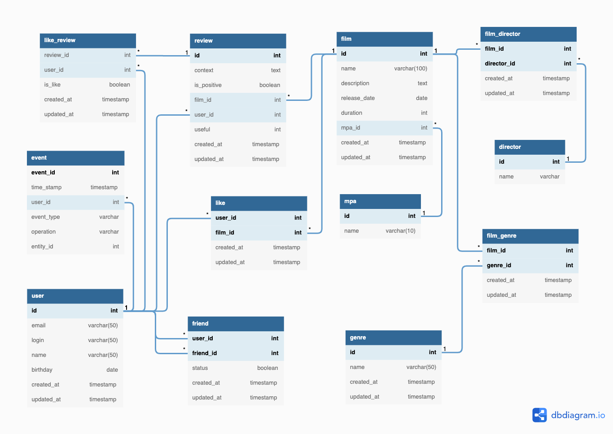

# Filmorate
Сервис для работы с фильмами и оценками пользователей

## /films
#### GET Возвращает список всех фильмов
#### GET /{id} Возвращает фильм по id
#### POST Создает фильм
```
{
"name": "nisi eiusmod",
"description": "adipisicing",
"releaseDate": "1967-03-25",
"duration": 100
}
```
#### PUT Обновляет данные у существующего фильма
```
{
"name": "nisi eiusmod",
"id": 1,
"description": "adipisicing",
"releaseDate": "1967-03-25",
"duration": 120
}
```
#### PUT /{id}/like/{userId} Создает лайк
#### DELETE /{id}/like/{userId} Удаляет лайк
#### GET /popular?count= Возвращает число популярных фильмов

## /users
#### GET Возвращает список всех пользователей
#### GET /{id} Возвращает пользователя по id
#### POST Создает пользователя
```
{
"login": "dolore",
"name": "est adipisicing",
"email": "mail@mail.ru",
"birthday": "1946-08-20"
}
```
#### PUT Обновляет данные у существующего пользователя
```
{
"login": "dolore",
"name": "est adipisicing",
"id": 1,
"email": "mail@yandex.ru",
"birthday": "1946-08-20"
}
```
#### PUT /{id}/friends/{friendId} Добавляет в друзья
#### DELETE /{id}/like/{userId} Удаляет из друзей
#### GET /{id}/friends Возвращает список друзей
#### GET /{id}/friends/common/{otherId} Возвращает список друзей, общих с другим пользователем

## Модель базы данных
https://dbdiagram.io/d/6280dc607f945876b61e9962



#### users
Таблица пользователей, все поля являются обязательными для заполнения, поле логин и email должны быть уникальными

#### friends
Таблица друзей, связи пользователей, может быть подтвержденной и не подтвержденной

#### films
Таблица фильмов, все поля являются обязательными для заполнения, для связи с жанрами служит отдельная таблица, рейтинг 
указывается из типа перечислений film_ratings, чтобы можно было реализовать поиск по названию фильма или описанию 
добавлены индексы для них

#### likes
Таблица лайков, связь пользователя и фильма

#### genres
Таблица жанров, поле названия является обязательным для заполнения и должно быть уникальным

#### film_genre
Таблица связи фильма и жанра

#### film_ratings
Перечесление рейтингов фильмов, в нем перечислены все рейтинги Ассоциации кинокомпаний Америки (англ. Motion Picture
Association of America)

### Примеры основных запросов (только на чтение)
Получение фильма по id
```
SELECT id,
        name,
        description,
        release_date,
        duration,
        rating
FROM films 
WHERE id = {id};
```
Получение всех фильмов
```
SELECT id,
        name,
        description,
        release_date,
        duration,
        rating
FROM films ;
```
Получение переданного количества популярных фильмов
```
SELECT f.id,
        f.name,
        f.description,
        f.release_date,
        f.duration,
        f.rating,
        COUNT(l.film_id) AS count_likes
FROM films f
LEFT JOIN likes l ON f.id = l.film_id
GROUP BY l.film_id
ORDER BY count_likes DESC
LIMIT {count};
```
Получение друзей пользователя
```
SELECT u.id,
        u.email,
        u.login,
        u.name,
        u.birthday
FROM users u
INNER JOIN friends f1 ON u.id = f1.friend_id
INNER JOIN friends f2 ON u.id = f2.user_id
WHERE f.status = 1
        AND (f1.user_id = {id}
        OR f2.friend_id = {id})
```
ИЛИ
```
SELECT id,
        email,
        login,
        name,
        birthday
FROM users 
WHERE id IN (
        SELECT user_id
        FROM friends
        WHERE friend_id = {id}
        UNION
        SELECT friend_id
        FROM friends
        WHERE user_id = {id}
)
```
Получение друзей, общих с другим пользователем
```
SELECT id,
        email,
        login,
        name,
        birthday
FROM users 
WHERE id IN (
        (
            SELECT user_id
            FROM friends
            WHERE friend_id = {userId}
            UNION
            SELECT friend_id
            FROM friends
            WHERE user_id = {userId}
        )
        INTERSECT
        (
            SELECT user_id
            FROM friends
            WHERE friend_id = {otherUserId}
            UNION
            SELECT friend_id
            FROM friends
            WHERE user_id = {otherUserId}
        )
)
```
Примечание: запросы написаны без преверки на реальной БД и могут быть доработаны или переделаны в несколько запросов
